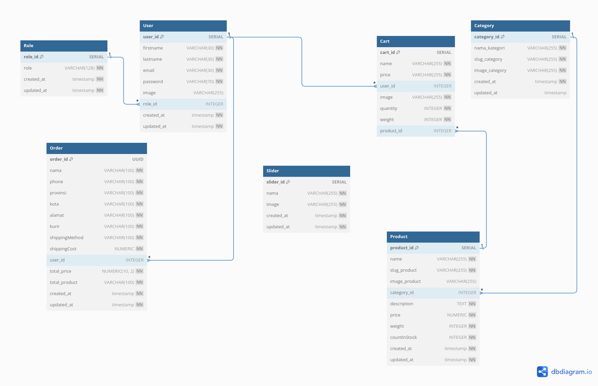
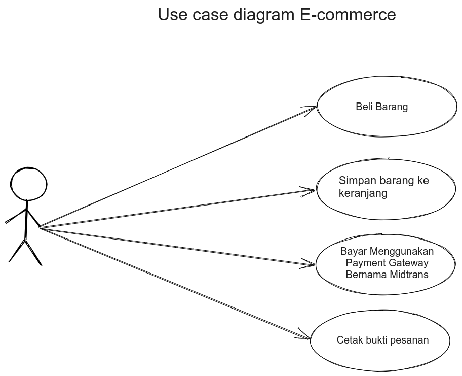
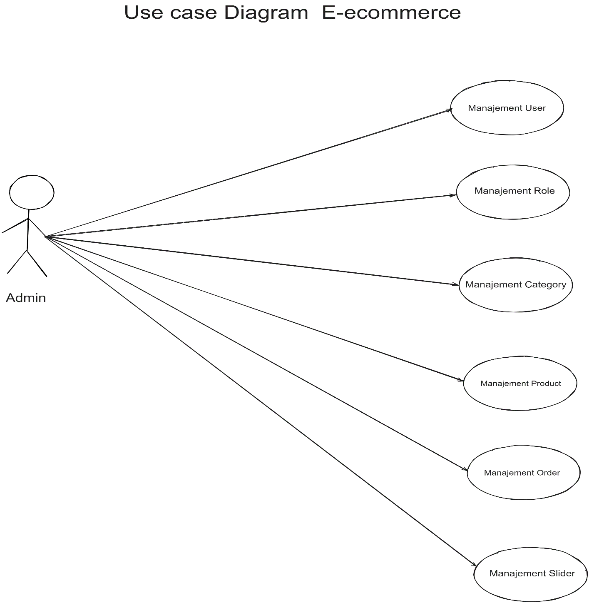
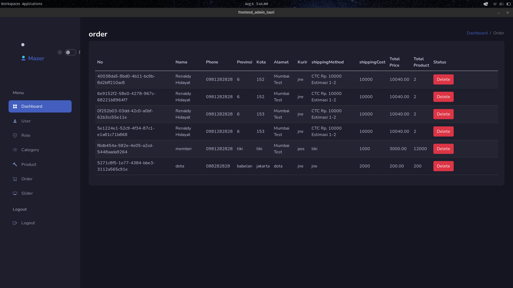
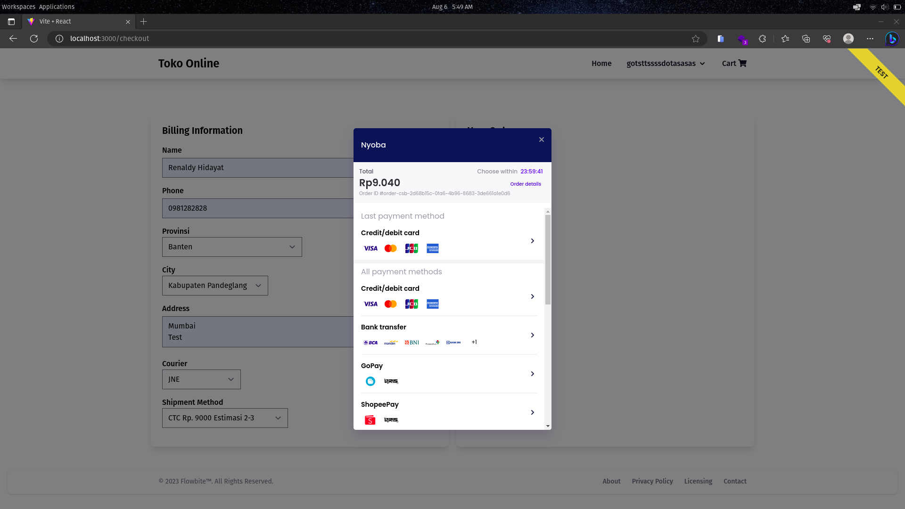
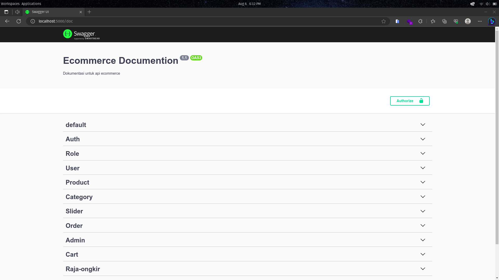

### Ecommerce

Ecommerce menggunakan tech stack:

Backend

- Typescript
- Framework Nest.js
- Postgresql
- Payment Gateway: Midtrans
- Raja Ongkir

Frontend:

- Javascript
- Framework Reactjs
- Redux toolkit
- Framework Css: Tailwind dan Flowbite

Frontend Admin:

- Javascript
- Tauri
- Rust
- Framework Reactjs
- Redux toolkit
- Framework css: Bootstrap dan Mazer Dashboard

 

 

 

## Demo

### Demo Admin

### Demo Frontend

### Demo Swagger

